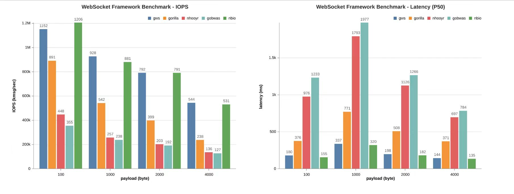

# go-websocket-testing
go websocket server testing

### 语言环境

- go
- nodejs

### 安装依赖

```bash
npm install pm2 -g
go install github.com/lxzan/wsbench@latest
```

### 开始

```bash
export PATH=$PATH:$GOPATH/bin
make build
pm2 start ./bin/*
cd frontend
npm install
pm2 start index.js --watch
sh bench.sh
```

测试程序退出后, 访问 http://localhost:8080

